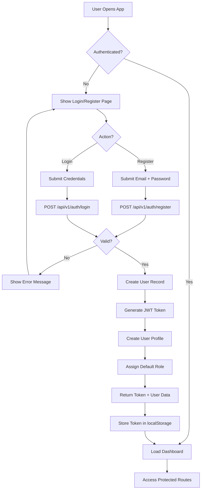
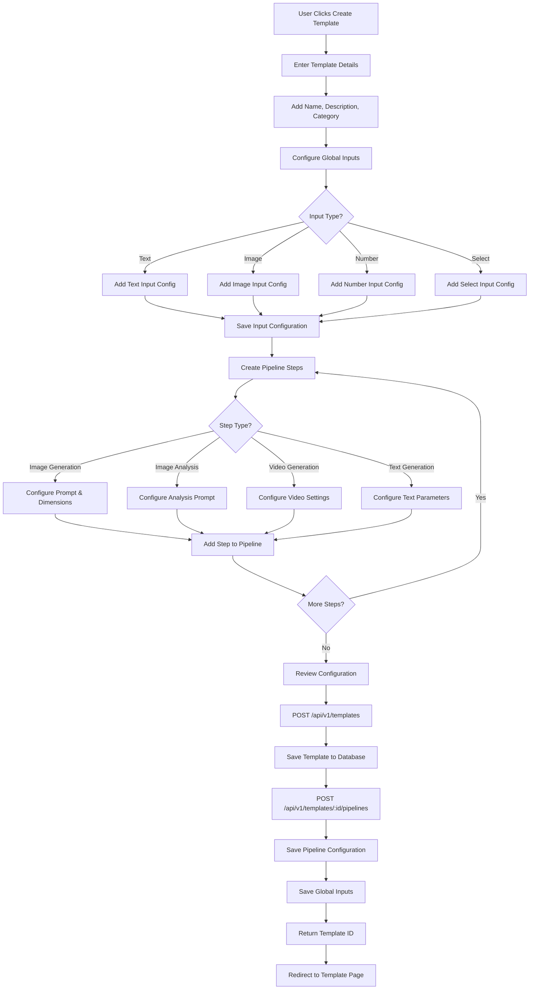
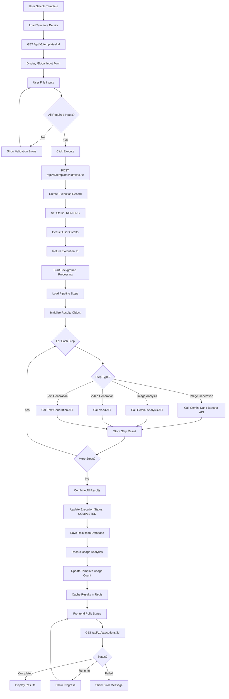
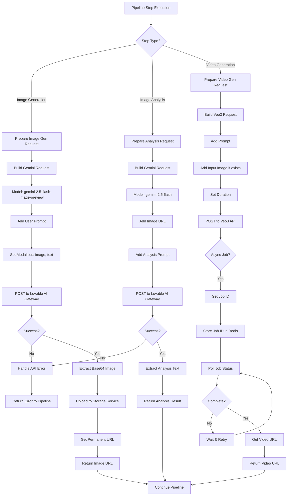
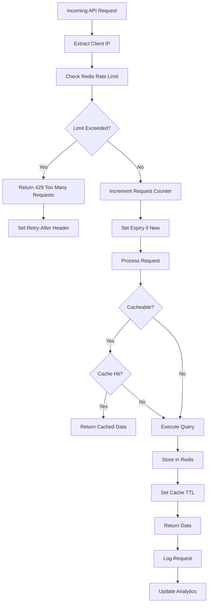
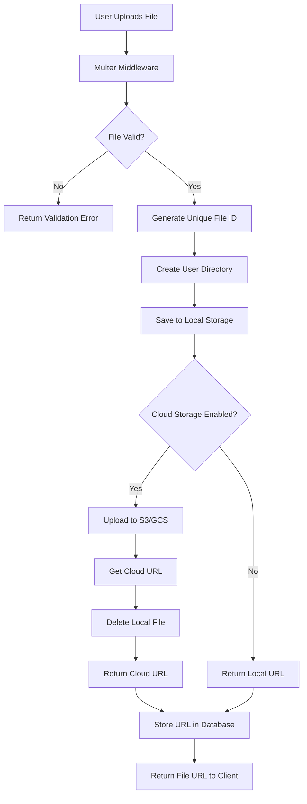
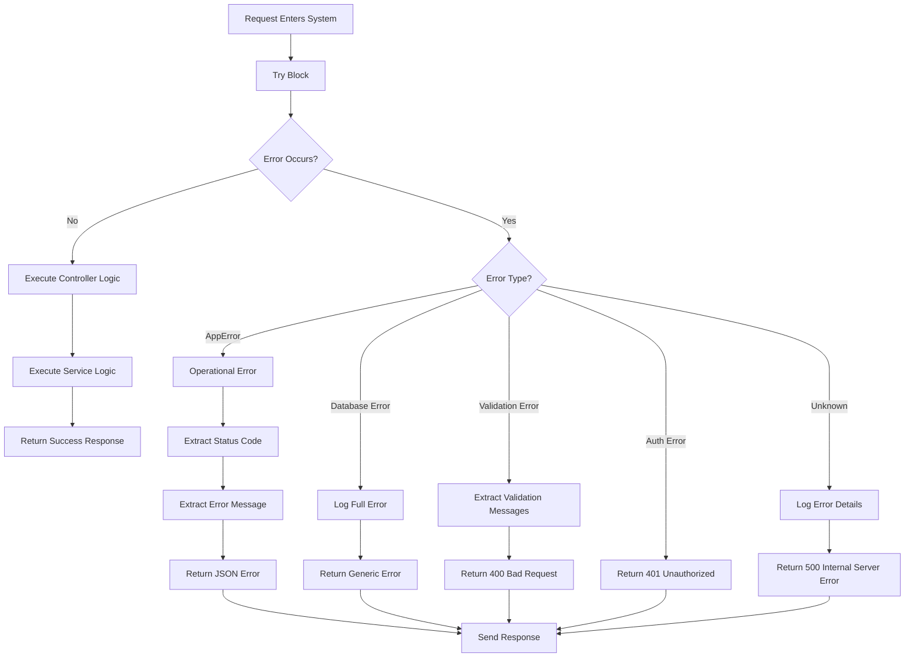
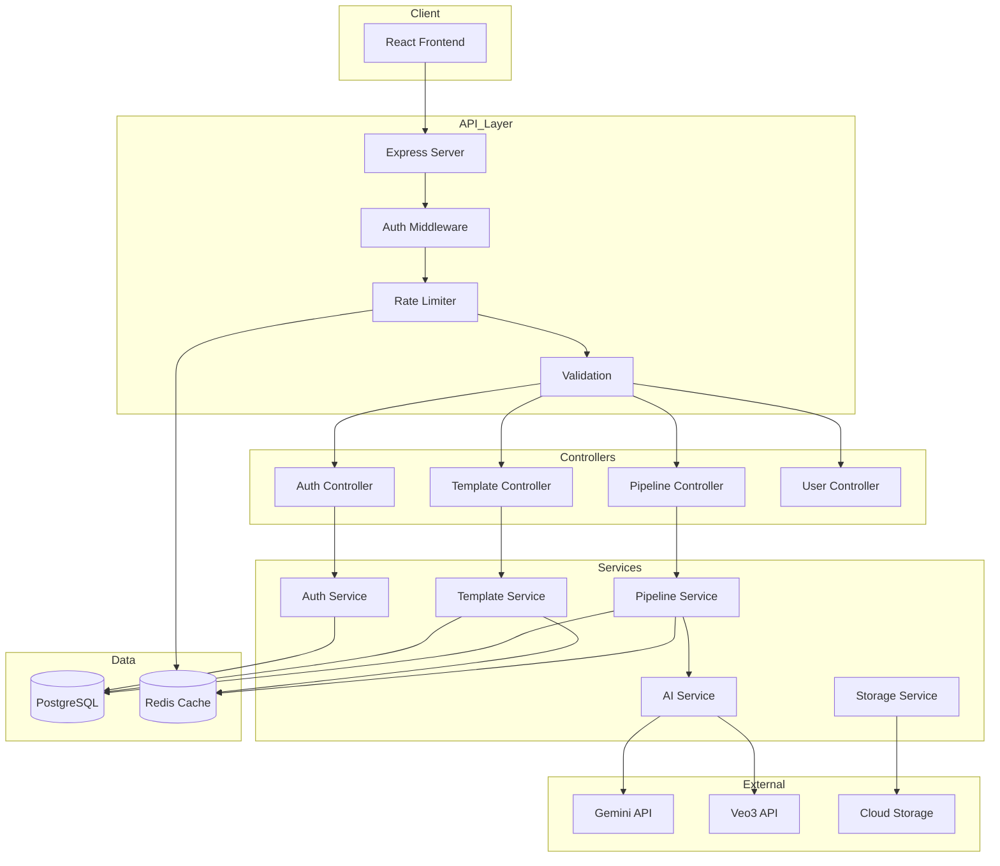

# System Flowcharts

## 1. User Authentication Flow

## 2. Template Creation Flow

## 3. Pipeline Execution Flow

## 4. AI Service Integration Flow

## 5. Rate Limiting & Caching Flow

## 6. File Upload & Storage Flow

## 7. Error Handling Flow

## Architecture Overview

